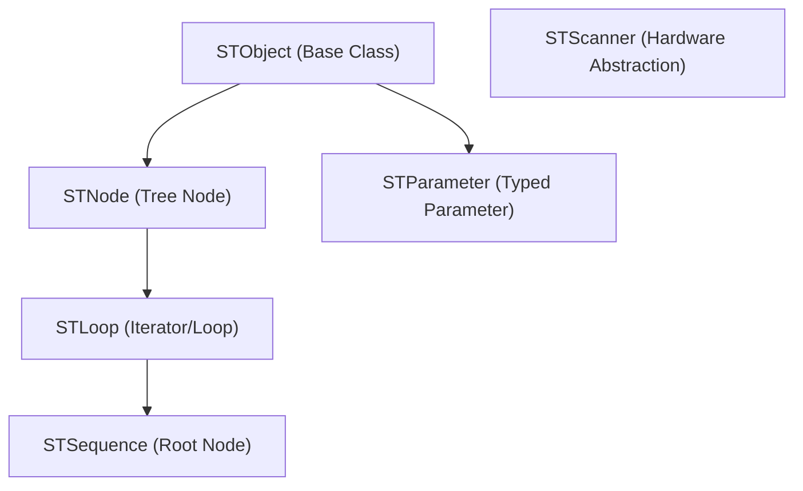
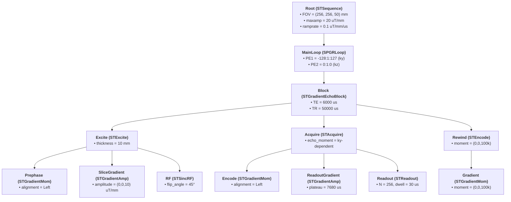

# SequenceTree 4

SequenceTree is a vendor-agnostic C++ IDE and framework for programming MRI pulse sequences. It provides an intuitive graphical user interface (GUI) for constructing MRI sequences as hierarchical trees, simulating their execution, plotting events (RF, gradients, readouts), and exporting them to target scanner hardware.

SequenceTree decouples the sequence definition from the physical scanner hardware, allowing scientists to develop and test pulse sequences in a virtual environment before compiling them against vendor-specific APIs (such as Siemens IDEA).

---

## Key Features

- **Visual Tree-Structured IDE:** Organize pulse sequences hierarchically into loops, blocks, and events.
- **Interactive Sequence Simulation:** Play and visualize sequences in a built-in simulation window. View RF, 3D gradient waveforms (X, Y, Z), and ADC readout events.
- **Automated Gradient Design:** The `STGradientMom` class dynamically designs optimal trapezoidal or triangular gradient waveforms under scanner constraints (maximum amplitude and slew rate) to achieve target k-space moments.
- **Phase & Frequency Correction:** Automatic correction calculation to handle slice-selection off-center shifts and FOV offset modulations.
- **Non-Cartesian Support:** Out-of-the-box support for radial trajectory sweeps (`STRadialLoop`) and arbitrary trajectories (`STArbGradient` and `STCircleGradient`).
- **Comprehensive CLI Simulator:** Run sequences in headless mode (`simulator`), validate timing, calculate SAR, and compute total sequence duration or block counts.
- **Cross-Platform Compilation:** Support for Linux (native), macOS (Apple Silicon & Intel), and containerized development via Docker with X11 graphics routing.

---

## System Architecture

SequenceTree uses a hierarchical structure where sequence objects inherit from core base classes:



### Core Framework Classes
- **`STSequence`:** The root of any sequence tree. Manages global parameters like FOV, maximum gradient amplitude (`maxamp`), ramp rate (`ramprate`), and gyromagnetic ratio (`gamma`).
- **`STNode`:** The primary node class representing sequence components. Handles timing (absolute and relative start times), duration, and k-space moments.
- **`STLoop`:** Manages parameter sweeps (using `STIterator`) such as iterating over phase encoding lines, slices, repetitions, or averages.
- **`STScanner`:** The hardware abstraction layer. Custom implementations translate sequence event calls to physical scanner commands. The built-in `STSimScanner` simulates scanner execution and collects waveform points.

### Foundation Nodetypes
SequenceTree includes standard pre-built MRI modules in `code/nodetypes/foundation`:
- **RF Pulses:** `STRF`, `STSincRF` (sinc-shaped selective pulse), `STSampledRF` (interpolates custom/external waveforms).
- **Gradients:** `STGradientMom` (automatically designs trapezoid to match target moment), `STGradientAmp` (direct amplitude/timing control), `STArbGradient`/`STCircleGradient` (arbitrary/elliptical waveforms).
- **Readout:** `STReadout` (ADC events and k-space indexing), `STAcquire` (Cartesian readout), `STMultiAcquire` (EPI readout trains).
- **Composite Blocks:** `STExcite` (slice selection and refocusing pre-phase), `STRefocus` (refocusing pulse with crushers), `STGradientEchoBlock`, `STSpinEchoBlock`.

---

## Directory Structure

```
.
├── bin/                    # Output directory for compiled binaries (st4 IDE, CLI simulator)
├── code/                   # Core C++ framework and nodetype libraries
│   ├── framework/          # Base definitions (STNode, STSequence, STScanner)
│   └── nodetypes/          # Prebuilt nodes (foundation & user-defined templates)
├── src/                    # Source code for the Qt5 IDE application
│   ├── gui/                # Qt5 user interface, main window, and plot viewers
│   └── st4controller/      # Controller interface linking GUI to SequenceTree logic
├── simulator/              # CLI simulation executable codebase
├── sequences/              # Save directory for sequence configurations (.sts)
├── examples/               # Example sequences (SPGR, Spin Echo, Radial, Fat Saturation)
├── doc/                    # Documentation, manuals, and protocol reference sheets
├── third_party/            # Static dependencies (FFTW, GNU Scientific Library archives)
├── Dockerfile              # Docker recipe setting up a standardized build environment
└── dev.sh                  # Native shell script for launching containerized IDE
```

---

## Installation & Setup (Container-Based Baseline)

To simplify the compilation of legacy C++ components and dependencies, SequenceTree uses a unified, pre-configured container environment. Follow these step-by-step instructions to get SequenceTree up and running on your system.

### Step 1: Install Docker on Your Computer
Docker hosts the pre-built environment containing all necessary compilers and physics libraries (FFTW/GSL).

#### 🍏 For macOS (Intel or Apple Silicon)
1. Download and install **[Docker Desktop](https://www.docker.com/products/docker-desktop/)** (select the installer matching your processor).
2. Open Docker Desktop and follow the setup prompts. Keep the application running in the background.
3. **Set up XQuartz (Crucial for GUI rendering):**
   - Download and install XQuartz from **[xquartz.org](https://www.xquartz.org/)**.
   - Open XQuartz, go to **Settings/Preferences** > **Security**, and check **"Allow connections from network clients"**.
   - Quit XQuartz and **restart your Mac**.

#### 🪟 For Windows (10 or 11)
1. Download and install **[Docker Desktop](https://www.docker.com/products/docker-desktop/)**. Ensure **WSL 2** integration is enabled, and restart when prompted.
2. Open PowerShell as Administrator and install Ubuntu:
   ```powershell
   wsl --install -d Ubuntu
   ```
   Set Ubuntu as your default environment:
   ```powershell
   wsl --set-default Ubuntu
   ```
   Set up your Linux username and password when prompted.
3. Open **Docker Desktop**, go to **Settings** > **Resources** > **WSL integration**, enable integration for your default distro, toggle **Ubuntu** to **ON**, and click **Apply & restart**.

#### 🐧 For Linux (Ubuntu / Pop!_OS)
Open your terminal and run:
```bash
sudo apt-get update
sudo apt-get install -y docker.io
sudo usermod -aG docker $USER
```
*Note: Log out of your system account and log back in (or reboot) to apply user group permissions.*

---

### Step 2: Download the SequenceTree Source Code
Open your terminal application (use the **Ubuntu** app on Windows, standard Terminal on macOS/Linux).

> [!IMPORTANT]
> **Windows Performance Tip:** Run `cd ~` in your Ubuntu terminal before cloning. Working inside the WSL2 home directory (`~`) prevents filesystem translation lag and compiles code 10x faster than accessing Windows host folders.

Clone the repository and enter the directory:
```bash
git clone https://github.com/btdvu/sequencetree4.git
cd sequencetree4
```

---

### Step 3: Load the Environment Archive
1. Download the **`sequencetree_base_environment.tar`** workspace archive from the GitHub Release assets.
2. Place the downloaded `.tar` file in the root of your `sequencetree4` directory.
   - *Windows Users:* Type `explorer.exe .` in Ubuntu to open the active Linux folder in Windows Explorer, then drag and drop the `.tar` file there.
3. Load the environment image into Docker:
   ```bash
   docker load -i sequencetree_base_environment.tar
   ```

---

### Step 4: First-Time Compilation
Use the helper script `dev.sh` to start your development container and compile the codebase:

1. **Windows Users Only:** Convert the helper script line endings:
   ```bash
   sudo apt update && sudo apt install -y dos2unix && dos2unix dev.sh
   ```
2. Make `dev.sh` executable and launch the workspace container:
   ```bash
   chmod +x dev.sh
   ./dev.sh
   ```
3. Inside the container sandbox terminal, compile SequenceTree:
   ```bash
   cd src
   qmake
   make -j$(nproc)
   cd ..
   ```

---

## 🔄 Running the Application

Once compiled, you do not need to repeat the installation. Simply run the developer container environment to launch either the GUI or the CLI simulator.

1. Open your terminal (Ubuntu terminal on Windows, making sure to `cd ~/sequencetree4` first).
2. Enter the container:
   ```bash
   ./dev.sh
   ```

### 1. Graphical User Interface (GUI IDE)
Inside the container, run:
```bash
cd bin
./st4
```
*The SequenceTree 4 window will open seamlessly on your screen.*

### 2. Command-Line Simulator
Inside the container, run the CLI tool to parse, check, or execute `.sts` sequence files:
```bash
./simulator [check|stat|run|raw_template] [param_input] [param_output] [sim_output] [results_output] [min_block] [max_block]
```
- **`check`**: Validates sequence timing constraints and checks for overlapping gradient events.
- **`stat`**: Exports sequence statistics (Total Duration, SAR, block count) to a results file.
- **`run`**: Runs a virtual Bloch-equation scanner simulation and saves simulated gradient/RF point matrices.

To exit the container at any time, close the graphical window and type `exit` in the terminal.

---

## 🛠️ Troubleshooting

<details>
<summary><b>❌ Error: "permission denied while trying to connect to the docker API"</b></summary>

- **Fix (Linux):** Run `newgrp docker` in your terminal to force-refresh user permissions, or log out of your session and log back in.
</details>

<details>
<summary><b>🖥️ Container runs, but no graphical window appears</b></summary>

- **macOS Users:** Ensure **XQuartz** is active. Verify "Allow connections from network clients" is checked in XQuartz settings, and that you restarted your Mac. If issues persist, run `xhost +localhost` on your Mac host terminal before launching `./dev.sh`.
- **Windows Users:** Ensure you launch the terminal from your **WSL2 Ubuntu app** (which uses WSLg graphical rendering), not the standard Command Prompt or PowerShell.
</details>

<details>
<summary><b>❌ Error: "The command 'docker' could not be found in this WSL 1 distro"</b></summary>

- **Fix (Windows):** Convert your Ubuntu instance to WSL 2:
  1. Open PowerShell as Administrator.
  2. Upgrade Ubuntu: `wsl --set-version Ubuntu 2`
  3. Set WSL2 as default: `wsl --set-default-version 2`
  4. Ensure WSL Integration for **Ubuntu** is enabled in Docker Desktop settings.
</details>

<details>
<summary><b>❌ Error: "permission denied while trying to connect to the docker API at unix:///var/run/docker.sock" (Windows/WSL)</b></summary>

- **Fix (Windows):** Force-restart the subsystem and refresh integration:
  1. Close your Ubuntu terminal.
  2. In PowerShell, shut down WSL: `wsl --shutdown`
  3. Quit and restart **Docker Desktop**.
  4. Reopen the Ubuntu app and try again. If it fails, toggle the Ubuntu integration toggle **OFF** and **ON** again inside Docker Desktop Settings.
</details>

---

## Example: SPGR Sequence Tree Hierarchy

SequenceTree designs sequences by nesting loop, block, and event nodes in a hierarchical tree. Below is the tree structure of the standard Spoiled Gradient Echo (SPGR) sequence configured in [sequences/spgr.sts](sequences/spgr.sts). For simplicity, this diagram illustrates the main imaging loop (`MainLoop`) layout (omitting the identical steady-state preparation loop branch, `PrepLoop`). The loop executes an `STGradientEchoBlock` composed of excitation, readout acquisition, and gradient spoiling/rewinding nodes.

### Visual Tree Hierarchy & Node Parameters


### Detailed Node-by-Node Parameters List

Below is a summary of the configuration parameters set at each node level of the SPGR sequence tree:

1. **Root (`STSequence`)**
   - `FOV`: `(256, 256, 50)` mm — Global field of view.
   - `maxamp`: `20` uT/mm — Maximum physical gradient amplitude.
   - `ramprate`: `0.1` [uT/mm]/µs — Slew rate constraint.
   - `gamma`: `42.5764` Hz/uT — Gyromagnetic ratio for $^1\text{H}$.

2. **PrepLoop / MainLoop (`SPGRLoop`)**
   - `PE1`: Iteration range for phase-encoding axis 1 (e.g., `-128:1:127` in the imaging loop, `1:1:10` in prep loop).
   - `PE2`: Iteration range for 3D phase-encoding partition (e.g., `0:1:0`).
   - `readout_dir`: `(1, 0, 0)` — Unit vector direction of readout axis.
   - `PE1_dir` / `PE2_dir`: `(0, 1, 0)` / `(0, 0, 1)` — Unit vector directions for phase encoding.
   - `RF_spoiling`: `1` (enabled) — Instructs loop run iteration to calculate pseudo-randomized phases for RF and ADC.

3. **Block (`STGradientEchoBlock`)**
   - `TE`: `6000` µs — Time to echo.
   - `TR`: `50000` µs — Repetition time.
   - `excite_time`: `1000` µs — Absolute timing offset of excitation inside the TR block.

4. **Excite (`STExcite`)**
   - `gradient_amplitude`: `(0, 0, 10)` uT/mm — Slice-select plateau gradient.
   - `slice_thickness`: `10` mm — Prescribed slice thickness.
   - `prephase`: `1` (enabled) — Automatically calculate and play refocusing/prephasing lobe.

5. **RF (`STSincRF`)**
   - `num_lobes_left` / `num_lobes_right`: `2` — Number of side lobes on each side of the sinc function peak.
   - `flip_angle`: `45` degrees — Target excitation flip angle.
   - `pulse_duration`: `1409.23` µs — Automatically sized to match bandwidth constraints.
   - `time_step`: `10` µs — Time discretization for digital pulse rendering.

6. **Acquire (`STAcquire`)**
   - `echo_moment`: `(0, -8073.72, 0)` [uT/mm]-µs — Desired moment at the center of the echo (driven by loop iteration and phase-encoding index).
   - `moment_per_point`: `(91.7468, 0, 0)` [uT/mm]-µs — Trajectory step per readout sample.

7. **Rewind (`STEncode`)**
   - `moment`: `(0, 0, 100000)` [uT/mm]-µs — Target moment on the slice/z axis to spoil/dephase residual transverse magnetization.
   - `do_rewind`: `1` (enabled) — Turns on the gradient rewinding node.

---

## Documentation

For a deep dive into using the IDE or extending classes, refer to the documents in the `doc/` directory:
- [doc/st4-users-manual.pdf](doc/st4-users-manual.pdf) — Comprehensive guide on IDE menus, custom sequence design, plotting controls, and parameter mappings.
- [code/framework/CODE_STRUCTURE.md](code/framework/CODE_STRUCTURE.md) — Reference documentation detailing internal variables and classes.
- [code/nodetypes/foundation/CODE_STRUCTURE.md](code/nodetypes/foundation/CODE_STRUCTURE.md) — Detailed class guide for standard RF pulses, readout ADCs, crushers, loops, and gradient shapes.

---

## License

This project is licensed under the terms of the GNU General Public License v2 (GPL-2.0). See [License.txt](License.txt) for the full license text.
